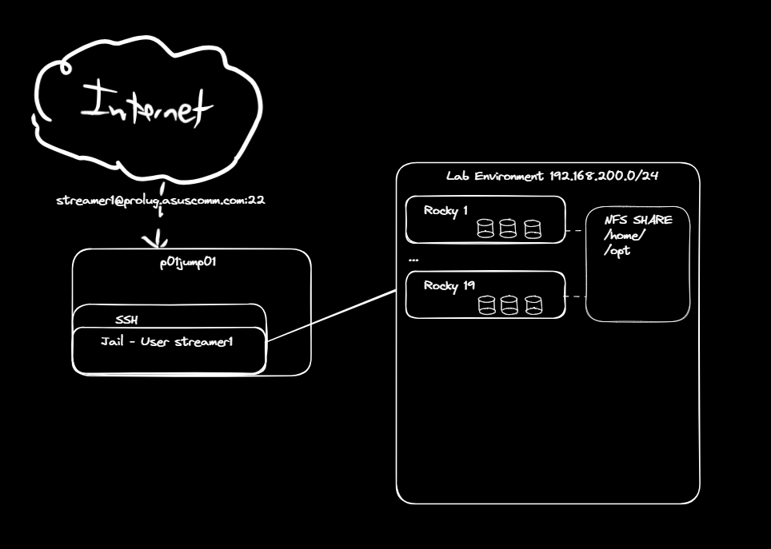

Welcome to the ProLUG Enterprise Linux Systems Administration Course Book.

## This Book

Contains all materials pertaining to the course including links to external resources.
It has been put together with care by a number of ProLUG group members referencing original
instructional materials produce by Scott Champine (het_tanis).

The content is version controlled with Git and stored here: <https://github.com/ProfessionalLinuxUsersGroup/lac/>

Furthermore, the book has been built with mdbook for ease of navigation. Be sure to try the search functionality.

**Course Description:**

This course addresses how the Linux systems work for administration level tasks inside a
corporate environment. This course will explore everything from the administration of a
Linux server and fundamental command line tasks to advanced topics such as patching and
web administration.

**Prerequisite(s) and/or Co-requisite(s):**

Prerequisites: None

**Credit hours: N/A**

**Contact hours: 120 (50 Theory Hours, 70 Lab Hours)**

### Course Summary

#### Major Instructional Areas

1. Server build and Hardware components
2. Command Line tools and Syntax
3. Basic Scripting
4. Linux networking
5. Linux security practices
6. Automation and repeating tasks
7. Implement Networking in Linux
8. Troubleshooting
9. Benchmarking and Baselining

#### Course Objectives

1. Explain the server build process and hardware system components.
2. Analyze system security and implement basic hardening of system.
3. Construct command line syntax to explore the system and gather resource information.
4. Construct scripting structures of assigning variables, conditional tests, and recording output to generate
   scripts that do basic system tasks.
5. Analyze and troubleshoot the Apache Web Server
6. Analyze and troubleshoot the NFS/Samba File Shares.
7. Analyze Docker and Kubernetes components and workflows.
8. Describe and troubleshoot network services.
9. Write and perform Ansible tasks to automate deployments to servers.

### Learning Materials and References

#### Required Resources

Cloud Lab server running Ubuntu on [Killercoda](https://killercoda.com/).

- Minimal resources can accomplish our tasks
  - 1 CPU
  - 2 GB Ram
  - 30 GB Hard Drive
  - Network Interface (IP already setup)

Local VM server running: RHEL, Fedora, Rocky

- Minimal resources
  - 1 CPU
  - 2GB RAM
  - 3 3-5GB Hard Drives
  - Network Interface (Bridged)

ProLUG Lab access to Rocky 9.4+ instance.

- Minimal resources can accomplish our tasks
  - 1 CPU
  - 4 GB RAM
  - 15 GB Hard Drive
  - 3 x 3GB hard drives (for raid and disk labs)
  - Network Interface (IP already setup)

### Course Plan

#### Instructional Methods

This course is designed to promote learner-centered activities and support the development of fundamental Linux skills. The course utilizes individual and group learning activities, performance-driven assignments, problem-based cases, projects, and discussions. These methods focus on building engaging learning experiences conducive to development of critical knowledge and skills that can be effectively applied in professional contexts.

#### Class size

This class will effectively engage 40-60 learners.

#### Class Schedule

Class will meet over weekend (Brown bag) sessions. 1 time per week, for 16 weeks. There will be a total of 16 sessions.

| Session |                                 Topic                                 |
| :-----: | :-------------------------------------------------------------------: |
|    1    |        Get Linux Lab Access - CLI Primer - vi/vim/nano basics         |
|    2    |          Essential Tools - Files, Redirects, and Permissions          |
|    3    |             Storage - Logical Volume Management and RAID              |
|    4    |                       Operating Running Systems                       |
|    5    |                  Security - Manage users and groups                   |
|    6    |                       Security - Firewalld/UFW                        |
|    7    |  Security - Patching the system/ Package Management - yum, dnf, rpm   |
|    8    |                       Scripting - System checks                       |
|    9    |                     Docker - K3s Setup and basics                     |
|   10    |                     K3s advanced w/ microservices                     |
|   11    |                          Monitoring systems                           |
|   12    |       Engineering - System baselining/benchmarking and testing        |
|   13    |                           System Hardening                            |
|   14    |                          Ansible Automation                           |
|   15    |                      Engineering Troubleshooting                      |
|   16    | Incident Response - Actual incident callout and information gathering |

#### Suggested Learning Approach

In this course, you will be studying individually and within a group of your peers, primarily in a lab environment. As you work on the course deliverables, you are encouraged to share ideas with your peers and instructor, work collaboratively on projects and team assignments, raise critical questions, and provide constructive feedback.
